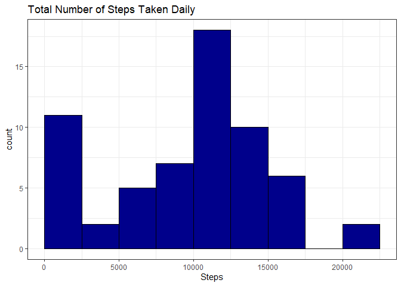
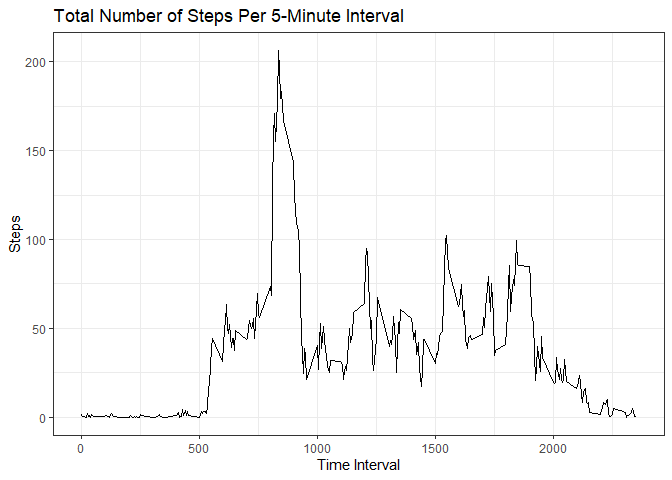
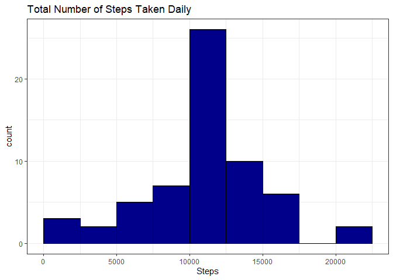
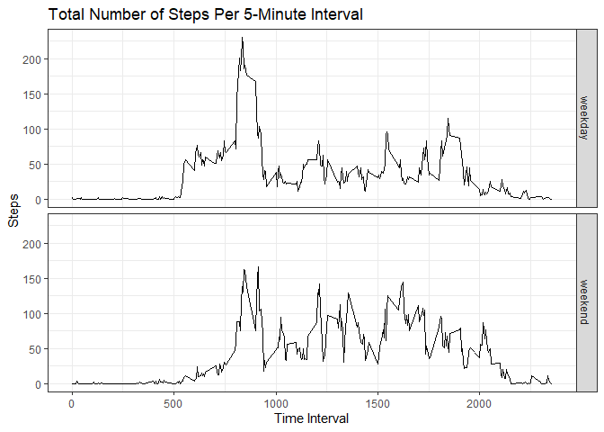

## Loading and preprocessing the data

```r
unzip("./activity.zip")
activity <- read.csv("./activity.csv")
activity$date <- as.Date(activity$date, "%Y-%m-%d")
```

## What is mean total number of steps taken per day?

```r
library(dplyr)
dailySum <- activity %>%
        group_by(date) %>%
        summarise(date = unique(date),
                  steps = sum(steps))
library(ggplot2)
g1 <- ggplot(dailySum, aes(x = steps)) + 
        geom_histogram(color = "black", fill = "darkblue", 
                       breaks = seq(0, 22500, by = 2500)) + 
        labs(title = "Total Number of Steps Taken Daily", 
             x = "Steps") + 
        theme_bw()
print(g1)
```

<!-- -->

```r
mean(dailySum$steps, na.rm = TRUE)
```

```
## [1] 10766.19
```

```r
median(dailySum$steps, na.rm = TRUE)
```

```
## [1] 10765
```

## What is the average daily activity pattern?

```r
intMean <- activity %>%
        group_by(interval) %>%
        summarise(interval = unique(interval),
                  steps = mean(steps, na.rm = TRUE))
g2 <- ggplot(intMean, aes(x = interval, y = steps)) + 
        geom_line() + 
        labs(title = "Total Number of Steps Per 5-Minute Interval", 
             x = "Time Interval", 
             y = "Steps") + 
        theme_bw()
print(g2)
```

<!-- -->

```r
intMean[which.max(intMean$steps), ]$interval
```

```
## [1] 835
```

## Imputing missing values

```r
sum(is.na(activity$steps))
```

```
## [1] 2304
```

```r
impute <- intMean$steps[match(intMean$interval, activity$interval)]
activity2 <- activity %>% mutate(steps = ifelse(is.na(steps), impute, steps))
dailySum2 <- activity2 %>%
        group_by(date) %>%
        summarise(date = unique(date),
                 steps = sum(steps))
g3 <- ggplot(dailySum2, aes(x = steps)) + 
        geom_histogram(color = "black", fill = "darkblue", 
                       breaks = seq(0, 22500, by = 2500)) + 
        labs(title = "Total Number of Steps Taken Daily", 
             x = "Steps") + 
        theme_bw()
print(g3)
```

<!-- -->

```r
mean(dailySum2$steps)
```

```
## [1] 10766.19
```

```r
median(dailySum2$steps)
```

```
## [1] 10766.19
```


## Are there differences in activity patterns between weekdays and weekends?

```r
activity2 <- activity2 %>% mutate(day = as.factor(ifelse(weekdays(date) %in% c("Saturday", "Sunday"), "weekend", "weekday")))
intMean2 <- activity2 %>%
        group_by(interval, day) %>%
        summarise(interval = unique(interval),
                  steps = mean(steps),
                  day = unique(day))
g4 <- ggplot(intMean2, aes(x = interval, y = steps)) + 
        geom_line() +
        facet_grid(day ~ .) +
        labs(title = "Total Number of Steps Per 5-Minute Interval", 
             x = "Time Interval", 
             y = "Steps") + 
        theme_bw()
print(g4)
```

<!-- -->
